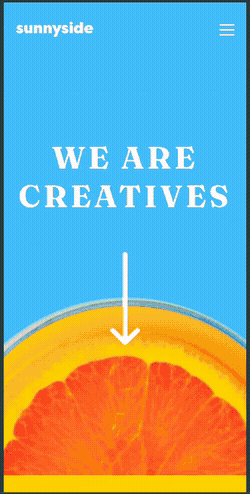

# 🍊 Sunnyside Agency Landing Page

Esta es mi solución al challenge de frontend mentor, inicie con mobile-first y metodología BEM. Practique mucho sobre grid y flex y los diferentes layouts.

### 🔗 Link al Proyecto
[ver sitio](https://francocam1.github.io/challenge-landing-page-sunny-agency/)

---

  <strong>Layout Mobile</strong> 
  

  <strong>Layout Desktop</strong> 
  

---

## 🚀 Stack Tecnológico

* **HTML5** semántico y metodología **BEM**.
* **CSS3** con enfoque **Mobile First**, Grid, Flexbox y animaciones.
* **JavaScript** nativo para lógica de menú y toggle de clases.
* **UI/UX:** Filtros de imagen y efectos hover personalizados.

---
Hecho por [francocam1](https://www.github.com/francocam1)